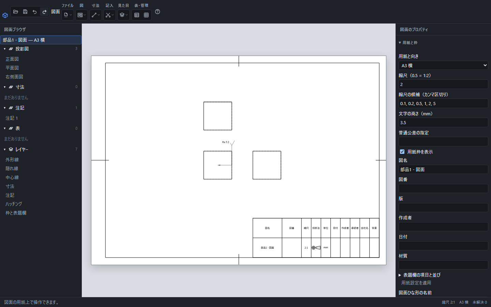

# 表面性状と加工注記を付ける

投影された面へ表面の仕上げを指示し、ねじ穴などの加工情報を注記できます。形状を参照する注記は、元の面や加工の情報に結び付きます。

正面図の面を参照し、Ra 3.2の表面性状を置いた画面。引出線の先端が対象の面を示しています。

## 表面性状を記入する

1. 図中の対象の面をクリックします。
2. 「記入」→「注記」を選びます。
3. 粗さの種類をRaまたはRzから選び、値を入力します。
4. 除去加工の指定、文字高さ、用紙位置を設定して「決定」を押します。

粗さの値には8/5のような式も使えます。負の値や計算できない式は確定できません。除去加工を指定する記号と、除去加工を許さない記号は異なります。製造へ渡す指示に合わせて選んでください。

## 加工情報を注記する

ねじ穴など、加工情報を持つ形状を選んで注記します。ねじの呼びやピッチは元の加工から決まり、自由な文字で別の呼びへ上書きしません。自由な文章を添える場合は[文字注記](drawing-note.md)を使います。

## 編集と参照切れ

配置後の注記を選ぶと、右で粗さ・文字高さ・位置などを編集できます。元の面への引出線は保持します。「元に戻す」で1操作ずつ戻せます。

元の面や加工が見つからなくなると、古い値をそのまま表示せず「？」を示します。図面の元部品と対象を確認してください。切断で生成された面を、切断前の別の面として選ぶことはありません。
