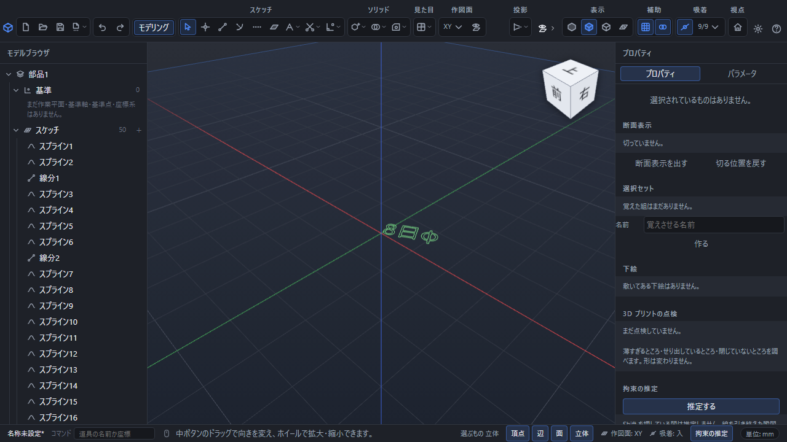

# 文字を輪郭にする・文字を含む図面を渡す

PointerCADでは、日本語を含む文字を形として扱えます。銘板や刻印を作る場合と、図面を相手へ渡す場合で操作が異なります。

「8 日 φ」をXY作図面の線分とスプラインへ変換した画面。左のスケッチ一覧に、変換で作成した輪郭の要素が並びます。

## 銘板・刻印の形を作る

部品画面で作図面を選び、「作図」→「文字をかく」を使います。置く位置をクリックし、文字列、高さ、角度、揃え方を指定して「決定」を押します。輪郭は通常の線分と曲線になるため、面を張って押し出すなど、ほかのスケッチと同じ加工に使えます。「8」などの内側の輪郭も残ります。

確定後は元の文字列を編集する欄は残りません。文章を変えたい場合は作成を取り消して入力し直します。詳しくは[文字をスケッチの輪郭にする](text-sketch.md)を参照してください。

## 図面を渡す

図面上の寸法・注記・表の文字は、PDFやSVGへ書き出すと輪郭になります。受け取った相手の端末に同じ字体がなくても、同じ文字の形で表示できます。輪郭化したPDFでは文字列の選択や検索はできません。

後から編集を続けるために、PDFや画像だけでなく、元の図面ファイルも保存してください。図面ファイルには編集する文章と式が残ります。

## 文字が表示されないとき

字体の読み込みに失敗した場合や、その字体に文字が含まれない場合は、画面下の理由を確認してください。別の文字へ勝手に置き換えません。スケッチの文字は空白だけの文字列や高さ0以下では作れません。

[図面の保存・書き出し](drawing-export.md)・[字体と解析ライブラリのライセンス](font-licenses.md)
