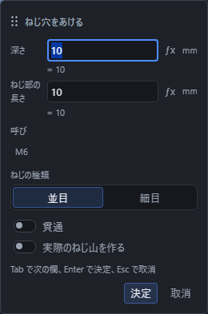
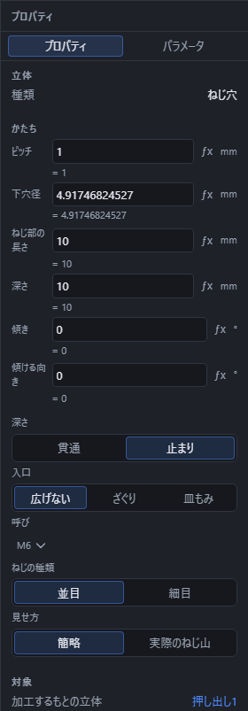

# ねじ穴をあける

立体にねじ山のついた穴(めねじ)をあけます。後半では、丸い軸の外側にねじを切る「外ねじ」(おねじ)も説明します。

## ねじ穴(めねじ)の手順

1. 「選択」の道具のまま、ねじ穴をあけたい**面**をクリックします。
2. Shift を押しながら、穴の**中心にする点**をクリックします(あらかじめ点の道具でかいておいたスケッチの点を使います)。
3. ツールバーの「ソリッド」区画で「加工」を押して一覧を開き、「ねじ穴」を押します。
4. 入力欄が出るので、「呼び」(M6 など)と「深さ」を入れて Enter を押します。

面や点を選ぶ前でも「ねじ穴」を押せます。対象が足りないときは、画面下の帯に選ぶものの案内が出ます。面をクリックし、Shift を押しながら中心の点を追加して、「加工」の一覧からもう一度「ねじ穴」を押すと入力欄が開きます。やめるときは Esc を押します。

## 「並目」と「細目」の違い

ねじの山のピッチ(山と山の間隔)には「並目」と「細目」の2種類があります。細目のほうがピッチが細かく、ゆるみにくくなります。特に理由がなければ、一般的な「並目」を選んでください。

## 呼びを選ぶと、ピッチと下穴径が自動で入る

「呼び」(M6 など)を選ぶと、規格の値からピッチと下穴径が自動で入ります。右の「プロパティ」で、どちらの数字もあとから直せます。ただし、そのあとで「呼び」を選び直すと、直した数字は失われ、また規格の値に戻ります。

## 「実際のねじ山を作る」は計算に時間がかかる

既定では、ねじの範囲を示す細い円が画面に出るだけの簡略な表示です。プロパティの「見せ方」を「実際のねじ山を作る」に切り替えると、らせん状の本物のねじ山を作ります。3D プリントでそのまま組み立てる部品を作るときなどに使いますが、**形の計算に時間がかかります**。普段の作業では、既定の簡略表示のままにしておくことをおすすめします。

## 止まり穴のときは、ねじ部の長さを深さ以下に

入力欄の「貫通」のつまみを切にすると、指定した深さまでの止まり穴になります。このとき「ねじ部の長さ」は、穴の深さ以下にしてください。深さより長いと、計算できずに理由が表示されます。

## ねじ穴がうまくいかないとき

「ねじ穴」を押しても何も起きないとき、または画面下の帯や作ったものの一覧に理由が出たときは、次を確かめてください。

| 出る文 | 直し方 |
|---|---|
| 穴をあける面が選ばれていません。 | 面をクリックしてから、もう一度「ねじ穴」を押します |
| 穴の中心にする点が選ばれていません。 | Shift を押しながら、中心にする点をクリックします |
| そのねじの呼びは使えません。一覧から選び直してください。 | 「呼び」を一覧から選び直します |
| ねじのピッチは 0 より大きい数にしてください。 | ピッチの数字を見直します |
| 下穴の径は 0 より大きい数にしてください。 | 下穴径の数字を見直します |
| 下穴の径はねじの外径より小さくしてください。 | 下穴径を、呼びの外径より小さい値に直します |
| ねじ部の長さは 0 より大きい数にしてください。 | ねじ部の長さの数字を見直します |
| ねじ部の長さは、穴の深さ以下にしてください。 | ねじ部の長さを深さ以下に小さくするか、深さを大きくします |

## 外ねじ(おねじ)を作る

「外ねじ」は、円柱状の軸の**丸い側面**にねじを切る道具です。ねじ穴のような中心の点や下穴は使いません。先に[基本形状](primitive.md)の「円柱」などで軸を作ります。たとえば M6 なら、半径 3 mm の円柱を用意します。

### 外ねじの手順

1. 「選択」で選ぶものを「面」(`3`)にし、軸の丸い側面をクリックします。端の平らな面ではありません。
2. 「ソリッド」の「加工」の一覧から「外ねじ」を押します。
3. 「外ねじの大きさ」の入力欄で「呼び」と「ねじの種類」(並目・細目)を選びます。選ぶと「ピッチ」に規格の値が入ります。
4. 「ピッチ」と「長さ」を確認します。どちらも `1/2` や `5*2` のような式で指定できます。「長さ」は軸に沿ってねじを切る範囲です。
5. 「切り始める端」で「手前の端」か「奥の端」を選びます。選んだ端から、もう一方の端へ向かってねじを切ります。
6. 必要なら「実際のねじ山を作る」を入にし、Enter または「決定」で作ります。左のモデルブラウザに「外ねじ1」のように追加されます。

側面を選ぶ前でも「外ねじ」を押せます。画面下の帯に対象の案内が出るので、丸い側面を選び、「加工」の一覧からもう一度「外ねじ」を押してください。入力中にやめるときは Esc を押します。

### 呼び・ピッチ・長さと端の決め方

- **呼び**は軸の太さに合わせて選びます。呼びを変えても、もとの軸の直径は変わりません。太さを変える場合は、円柱など、軸を作った操作の寸法を直してください。
- **ピッチ・長さ**は 0 より大きい値を入れます。ねじを切りたい部分が軸の中に収まるよう、長さと端を確認してください。外ねじには「貫通」や下穴径の欄はありません。
- **手前の端・奥の端**は、その軸に決まった 2 つの端を指します。視点を回しても入れ替わりません。できたねじの印やねじ山が意図した端にあるか確認し、逆なら「切り始める端」を切り替えてください。

### 簡略表示と実際のねじ山

「実際のねじ山を作る」は、はじめは切です。この簡略表示では、軸の形を変えずにねじの範囲を示す印を表示します。入にすると、軸の表面を削ってらせん状のねじ山を作ります。実際のねじ山が必要な 3D プリント用の部品などで使いますが、簡略表示より計算に時間がかかります。

### 作った外ねじを直す・取り消す・保存する

左のモデルブラウザで作った外ねじを選ぶと、右の「プロパティ」で「呼び」「ねじの種類」「ピッチ」「ねじ部の長さ」「切り始める端」「実際のねじ山を作る」を変更できます。作成時の「長さ」は、ここでは「ねじ部の長さ」という名前です。

呼びやねじの種類を選び直すと、ピッチは規格の値に戻ります。独自の式を使う場合は、呼びと種類を決めてからピッチを入れ直してください。

「元に戻す」(Ctrl+Z)で直前の作成や変更を取り消せます。「やり直す」(Ctrl+Y)で戻した操作をやり直せます。[保存して開く](save-and-open.md)の手順で保存すると、開き直した後も外ねじを選んで寸法や端、ねじ山の有無を編集できます。

### 外ねじがうまくいかないとき

画面下の帯やモデルブラウザに出た理由を確認します。

| 出る文 | 直し方 |
|---|---|
| ねじを切れるのは丸い軸の面だけです。 | 円柱状の軸の側面を選びます。端の平面や円錐の側面は選びません |
| ねじのピッチは 0 より大きい数にしてください。 | ピッチの式と値を見直します |
| ねじ部の長さは 0 より大きい数にしてください。 | 長さの式と値を見直します |
| ねじのピッチが軸の太さに対して大きすぎます。呼び径を見直してください。 | 軸の太さに合う呼びとピッチにします。軸の太さを変えるには、もとの円柱などの寸法を直します |
| おねじを作れませんでした。ねじ部の長さや向きを見直してください。 | 長さと切り始める端を見直します |
| おねじの溝が軸に当たりませんでした。ねじ部の長さや向きを見直してください。 | ねじを切る範囲が軸に重なるよう、長さと切り始める端を見直します |
| おねじを作るもとの面が見つかりません。形が大きく変わったため、選び直してください。 | もとの軸の形を確認し、必要ならその側面を選んで外ねじを作り直します |
