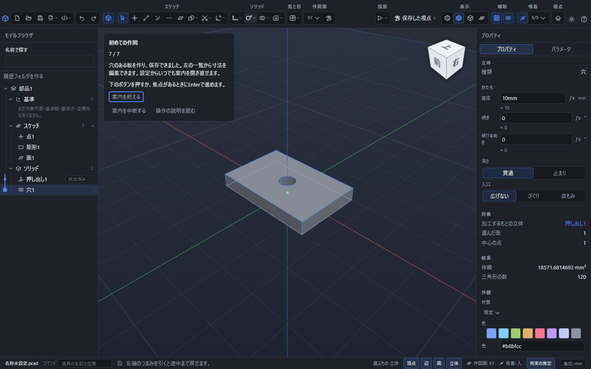

# 初めての作図

点を一つ置き、矩形の輪郭に面を張り、厚みと穴を付けて保存するまでを実際の部品で練習します。
案内に出る入力欄は、普段の作図と同じものです。作った部品は通常の保存、再編集、元に戻す操作で扱えます。

## 案内を始める

空の部品の画面か、{{ui:toolbar.settings.open}}から{{ui:tutorial.start}}を押します。
以前に案内を終えた端末でも、設定から開き直せます。
作りかけの文書がある場合は、その文書を保存してから新規の部品を開いてください。
案内は既存の文書を消したり、見本の部品で置き換えたりしません。

## 穴のある板を作る

1. {{ui:tutorial.action.point}}を押します。原点のX・Y・Zは0mmです。Enterで決めます。
2. {{ui:tutorial.action.outline}}を押します。最初の角はX=-30mm、Y=-20mm、Z=0mmです。Enterで決め、次の角までX方向60mm、Y方向40mm、Z方向0mmをEnterで決めます。
3. {{ui:tutorial.action.face}}を押します。矩形の内側に面ができます。
4. {{ui:tutorial.action.extrude}}を押し、距離8mmをEnterで決めます。
5. {{ui:tutorial.action.hole}}を押し、直径10mmの貫通穴をEnterで決めます。板の上面と最初の点を案内が選びます。
6. {{ui:tutorial.action.save}}を押し、保存先を決めます。保存できたことを確認して{{ui:tutorial.action.complete}}を押します。

各段階の計算が終わると、次のボタンへ焦点が移ります。ボタンにもEnterが使えるので、初期値を変えずに進められます。
数値はmmを明記しているため、普段の長さの単位がインチでも同じ大きさの見本になります。
途中で寸法を変えることもできます。穴が板から外れるなど計算できない値にした場合は、表示された理由を確認して直してください。

## 取り消す・途中から続ける

入力中のEscは、その操作の入力を取り消します。作成済みの点や板は残り、案内から同じ操作を開き直せます。
{{ui:tutorial.pause}}は案内だけを閉じます。作成済みの部品と入力中の数値は残ります。同じ画面の設定から案内を開くと続けられます。
元に戻して点や穴がなくなった場合、案内も必要な段階へ戻ります。
別の文書を開いた場合は、前の案内の続きをその文書へ実行しません。
案内の進行自体は端末を閉じるまでの一時状態です。再起動する前に作った部品を保存してください。

保存先の選択を取り消した場合、案内は保存の手順に残ります。計算の失敗や中止も完了として数えません。
{{ui:tutorial.help}}または案内上のF1で、この説明を開けます。

関連する操作: [その場の数値入力](numeric-input.md)、[面を張る](face-and-color.md)、[押し出し](solid-basics.md)、[穴](hole.md)、[保存して開く](save-and-open.md)。
