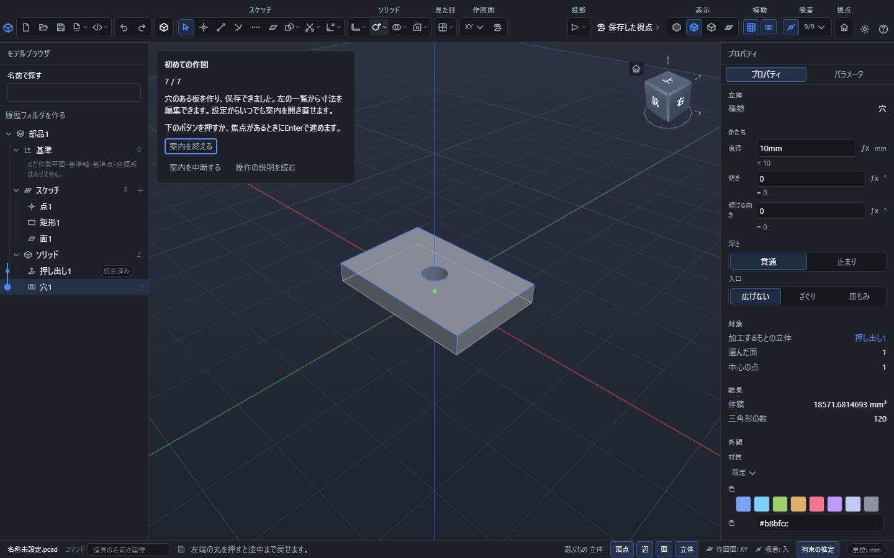

# 初めての作図

点を一つ置き、矩形の輪郭に面を張り、厚みと穴を付けて保存するまでを実際の部品で練習します。
案内に出る入力欄は、普段の作図と同じものです。作った部品は通常の保存、再編集、元に戻す操作で扱えます。

## 画面の見方

画面は次の5つの場所に分かれています。案内や説明書の文中では、この呼び方を使います。

| 場所 | 呼び方 | 何があるか |
|---|---|---|
| いちばん上 | 上のボタンの並び | 新規・開く・保存と{{ui:toolbar.fileMenu.groupLabel}}、元に戻す・やり直す、「{{ui:toolbar.sketch.groupLabel}}」「{{ui:toolbar.solid.title}}」などの道具。右端には、歯車の{{ui:toolbar.settings.open}}と、丸に「?」の図柄のヘルプが並びます |
| 左 | {{ui:featureTree.title}} | 作ったスケッチや立体の一覧。行を選ぶと、その寸法を右で直せます |
| 中央 | 3D の表示 | かいた形と立体。右上の立方体で見る向きを変えられます([画面を回す・動かす・拡大する](viewport.md)) |
| 右 | {{ui:propertyPanel.title}} | 選んだものの寸法や色などの値 |
| いちばん下 | 下の帯 | いまの道具の案内、計算の進み具合、うまくいかなかった理由、開いているファイルの名前 |

道具を選ぶと、下の帯に次に行う操作が出ます。形の計算中もこの案内を読みながら操作できます。案内の隣の回る印と「{{ui:statusBar.activityComputing}}」は、形を計算している目印です。初回の準備中は「{{ui:statusBar.activityPreparing}}」、進み具合が分かるときは「計算中 1/3」のように表示されます。印にカーソルを重ねると、詳しい状況が読めます。長い計算では進み具合の細い帯と「{{ui:statusBar.cancel}}」も出ます。

## 案内を始める

まだ何もかいていない部品では、3D の表示の中央に「{{ui:emptyState.firstStep}}」という一言と{{ui:tutorial.start}}のボタンが出ます。このボタンを押すと案内が始まります。
中央のボタンは、案内を最後まで終えると出なくなります。そのあとも、画面のいちばん上の右端、ヘルプのボタンのとなりにある歯車のボタン({{ui:toolbar.settings.open}})を押し、開いた設定の中の{{ui:tutorial.start}}から開き直せます。
作りかけの文書がある場合は、その文書を保存してから新規の部品を開いてください。
案内は既存の文書を消したり、見本の部品で置き換えたりしません。

## 穴のある板を作る

案内は 3D の表示の左上に出ます。「1 / 7」のように今の段階と全体の数、その段階ですることの説明、次へ進むボタンが並びます。
ボタンを押すと、普段の作図と同じ小さな入力欄が開きます。値を決めるか Esc で取り消すまでは、案内のボタンは押せません。

1. {{ui:tutorial.action.point}}を押します。原点のX・Y・Zは0mmです。Enterで決めます。
2. {{ui:tutorial.action.outline}}を押します。最初の角はX=-30mm、Y=-20mm、Z=0mmです。Enterで決め、次の角までX方向60mm、Y方向40mm、Z方向0mmをEnterで決めます。
3. {{ui:tutorial.action.face}}を押します。矩形の内側に面ができます。
4. {{ui:tutorial.action.extrude}}を押し、距離8mmをEnterで決めます。
5. {{ui:tutorial.action.hole}}を押し、直径10mmの貫通穴をEnterで決めます。板の上面と最初の点を案内が選びます。
6. {{ui:tutorial.action.save}}を押し、保存先とファイルの名前を決めます。ブラウザによっては場所を選べず、いつものダウンロード先へ保存されます([保存する・開く](save-and-open.md))。保存できたことを確認して{{ui:tutorial.action.complete}}を押します。

各段階の計算が終わると、次のボタンへ焦点が移ります。ボタンにもEnterが使えるので、初期値を変えずに進められます。
数値はmmを明記しているため、普段の長さの単位がインチでも同じ大きさの見本になります。
途中で寸法を変えることもできます。穴が板から外れるなど計算できない値にした場合は、表示された理由を確認して直してください。

## 取り消す・途中から続ける

入力中のEscは、その操作の入力を取り消します。作成済みの点や板は残り、案内から同じ操作を開き直せます。
{{ui:tutorial.pause}}は案内だけを閉じます。作成済みの部品と入力中の数値は残ります。同じ画面の設定から案内を開くと続けられます。
元に戻して点や穴がなくなった場合、案内も必要な段階へ戻ります。
別の文書を開いた場合は、前の案内の続きをその文書へ実行しません。
案内がどこまで進んだかは、アプリ(Web版ではそのページ)を閉じると消えます。閉じる前に、作った部品を保存してください。

保存先の選択を取り消した場合、案内は保存の手順に残ります。計算の失敗や中止も完了として数えません。
{{ui:tutorial.help}}または案内上のF1で、この説明を開けます。

関連する操作: [その場の数値入力](numeric-input.md)、[面を張る](face-and-color.md)、[押し出し](solid-basics.md)、[穴](hole.md)、[保存して開く](save-and-open.md)。
