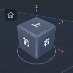
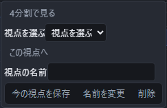
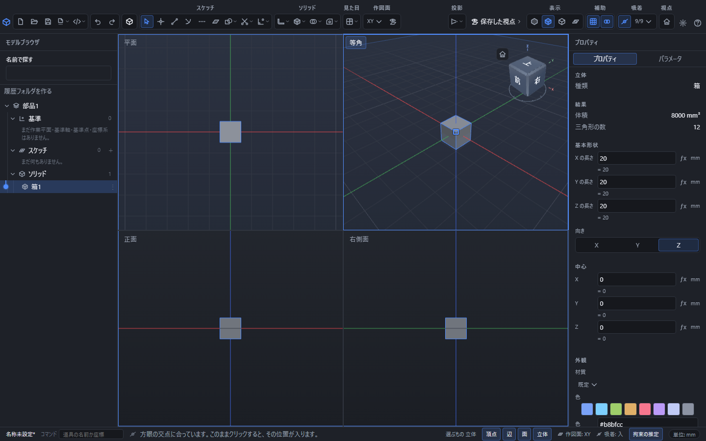

# 画面を回す・動かす・拡大する

3D の表示は次の操作で動かせます。

| やりたいこと | 操作 |
|---|---|
| 見る向きを変える | マウスの中ボタンを押しながら動かす |
| 表示を平行に動かす | マウスの右ボタンを押しながら動かす。Shift キーと中ボタンでも同じ操作ができます |
| 拡大・縮小する | マウスホイールを回す |
| 最初の向き・中心・大きさに戻す | Home キーを押す |

右ドラッグでは、画面を引っ張るように表示の中心を動かせます。透視投影でも平行投影でも使えます。右ボタンを動かさずに押して離すと、[道具の一覧](./radial-menu.md)が開きます。平行移動を始めた後は、押し始めた位置へ戻して離しても一覧は開きません。部品や組立の形、作図途中の入力は変わりません。

**最初の向き**は、部品を斜め上の右手前から見た向きです。**「前」の面(手前に向いた面)と「上」の面、「右」の面の 3 つが見えます。** 起動した直後も、新しく作り直したときも、Home キーや「視点」の家のボタンで戻したときも、いつも同じこの向きになります。

中ボタンが無いマウスやノートパソコンのタッチパッドでは、次の操作でも同じことができます。

| やりたいこと | 操作 |
|---|---|
| 見る向きを変える | Alt キーを押しながら、左ボタンで動かす |
| 表示を平行に動かす | Alt キーと Shift キーを押しながら、左ボタンで動かす |
| 拡大・縮小する | タッチパッドを2本の指で上下になぞる |

画面の右上には向きを示す立方体があります。「前」「後」「右」「左」「上」「下」と書かれた面をクリックすると、その向きから見た表示に切り替わります。角や辺をクリックすると、斜めから見た表示になります。立方体をそのままドラッグしても向きを変えられます。

平行移動した後の立方体の操作は、移動した中心の周りで向きを変えます。Home キーや家のボタンで視点を戻すと、中心も原点に戻ります。

面・辺・角にカーソルを重ねると、切り替わる部分に色と輪郭が付きます。押している間は色が濃くなり、向きが切り替わると強調が消えます。立方体の下のリングと、赤の X・緑の Y・青の Z が方向の目印です。3つの軸の文字は立方体の外側に並び、向きを回しても面の奥に隠れません。リングと軸の文字は目印なので、向きを変えるときは立方体を操作します。

立方体の左上の家のボタンを押すと、前・上・右の3面が見える最初の向きと大きさに戻ります。上の「視点」の家のボタンや Home キーと同じ操作です。家のボタンは Tab キーで選び、Enter キーまたはスペースキーでも押せます。立方体と文字の大きさ、配色は「設定」の拡大率とテーマに合わせて変わります。

## 画面の上のボタンで見え方を変える

画面の上の右のほうに、見え方を変えるボタンが「投影」「表示」「補助」「視点」に分かれて並んでいます。図柄のボタンには、カーソルを重ねると名前と説明が出ます。いま選ばれているものは青い下地で分かります。

**「投影」は 1 つのボタンにまとまっています。** 押すと 2 つの見せ方の一覧が開き、ボタンの図柄はいま効いているほうの絵になります。押さなくても、図柄を見ればどちらで見ているかが分かります。

| 区画 | ボタンの図柄 | できること |
|---|---|---|
| 投影 | 奥の 1 点へ集まる線 | 遠近をつけて見せます(奥のものほど小さくなります) |
| 投影 | 平行なまま伸びる線 | 遠近をつけずに見せます(奥でも大きさが変わりません) |
| 表示 | 塗りだけの立方体 | 面だけを塗って見せます |
| 表示 | 塗りと線の立方体 | 面を塗り、その境目の線も引きます |
| 表示 | 線だけの立方体 | 線だけで見せます |
| 補助 | 方眼 | 方眼と XYZ 軸を出すか消すかを切り替えます |
| 視点 | 家 | 斜め上から見た最初の向き(前・上・右が見える向き)に戻します(Home キーと同じ) |

「補助」にはもう 1 つ「続けてかく」があります。これは見え方ではなく、かき方の設定です。「点・線・円弧をかく」を見てください。

## 同じ視点へ戻る

「保存した視点」を開くと、向きと拡大率に名前を付けて残せます。部品とアセンブリのどちらでも使えます。

1. 見たい向きと大きさに表示を整えます。
2. 「保存した視点」を開き、「視点の名前」を入力します。
3. 「今の視点を保存」を押します。

戻るときは「視点を選ぶ」で名前を選び、「この視点へ」を押します。位置・注視点・上方向・透視／平行投影・拡大率が戻ります。最初から「正面」「平面」「右側面」「等角」の4つが入っています。

名前を選んでから入力欄を書き直して「名前を変更」を押すと改名できます。「削除」は、その視点の登録を消します。保存・改名・削除はCtrl+Zで取り消せます。視点を呼び出す操作は、部品やアセンブリの形を変更しません。

視点の登録は部品・アセンブリのファイルへ保存されます。ファイルを開き直した後も同じ名前から呼び出せます。空の名前と、すでに登録されている名前は使えません。

## 4つの向きから同時に見る

「保存した視点」を開いて「4分割で見る」を押します。左上が平面、左下が正面、右下が右側面、右上が等角です。平面・正面・右側面は平行投影で表示します。等角だけは、画面上部の透視／平行の切替を使えます。

操作したい区画へポインタを移します。枠の色が変わった区画が操作対象です。区画の名前のボタンからも選べます。

- ホイールでその区画だけを拡大・縮小します。
- 右ドラッグすると、その区画だけを平行移動します。Shiftを押しながら中ボタンでドラッグしても同じです。
- 等角では中ボタンのドラッグで回転します。他の3区画は正面の向きを保ちます。
- ドラッグが隣の区画へ出ても、押し始めた区画を操作し続けます。
- Homeキーとホーム視点のボタンは、操作対象の区画だけを初期位置へ戻します。

各区画の立体をクリックして選べます。選択した立体は共通なので、他の区画でも同じ立体が強調されます。「1画面に戻す」を押すと、4分割へ切り替える前の向きと拡大率へ戻ります。4分割中に「今の視点を保存」を使うと、操作対象の区画の視点が登録されます。保存した視点の「この視点へ」は、1画面へ戻してその視点を呼び出します。
