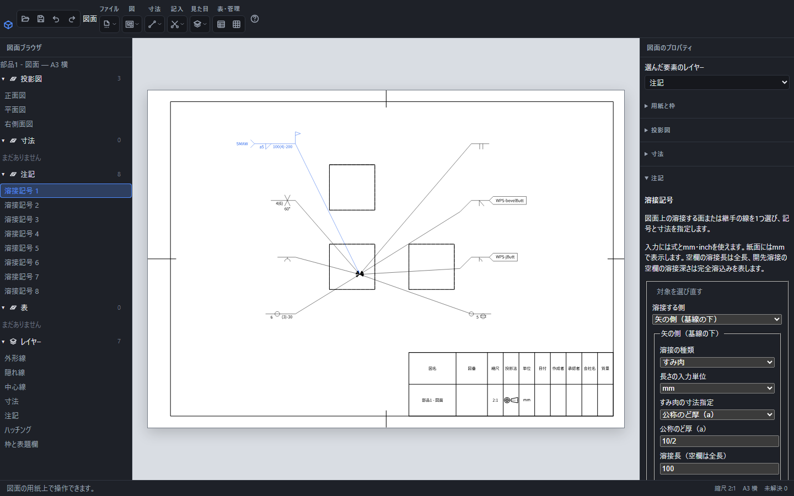
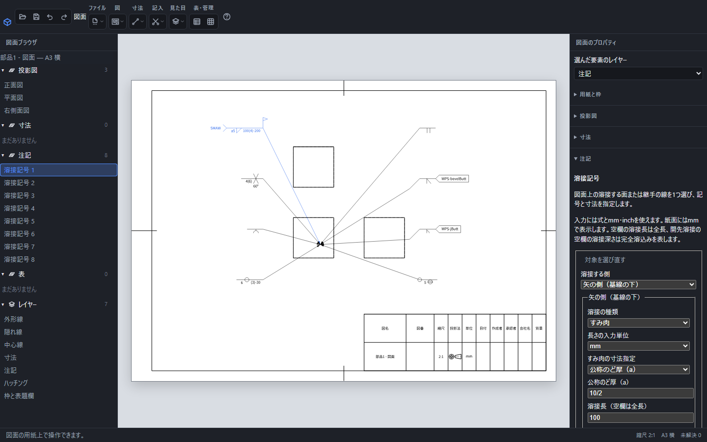

# 溶接記号で施工する側・寸法・方法を伝える

図面の「記入」→「溶接記号」で、溶接する箇所に結び付いた記号を作れます。矢、基線、寸法、施工方法を一緒に編集できます。対応する表示方式はJIS Z3021:2016のSystem Bです。

この画面は、記号の種類を同じ用紙で見比べるための操作例です。

## 最初のすみ肉溶接を記入する

1. 部品またはアセンブリから図面を作成します。
2. 「記入」→「溶接記号」を押し、溶接する面または継手の線を1つ選びます。先に対象を選んでから道具を開くこともできます。
3. 右の「溶接する側」を選びます。矢が指す側なら「矢の側（基線の下）」です。
4. 「溶接の種類」を「すみ肉」にし、脚長または公称のど厚を入力します。
5. 「決定」を押します。位置を空欄にすると、対象から横・縦へ20mm離れた位置に基線を置きます。

脚長は数値、公称のど厚は数値の前にaを付けて表示します。例えば、のど厚に`10/2`を入力すると紙面には`a5`と出ます。数値だけでなく、図面のパラメータ名を含む式も入力できます。

## 施工する側を選ぶ

| 選択 | 記号を置く位置と意味 |
| --- | --- |
| 矢の側 | 基線の下に置き、矢が指す側の施工を示します。 |
| 反対側 | 基線の上に置き、同じ継手の反対側の施工を示します。 |
| 両側 | 上下を別々に入力できます。両側の種類や寸法が異なる場合も保持します。 |
| 側に関係しない抵抗溶接 | スポットまたはシームを基線の中央に置き、部材の接触面での施工を示します。 |

両側のV形開先を選ぶと、上下のVでX形を表せます。左右に矢を向け直しても上下の意味は変わりません。

基線と尾は対象から離れる側へ伸びます。記号を対象の左右へ移動しても、基本記号と文字は鏡像にならず、サイズは記号の左、長さは右に残ります。

## 基本記号とサイズ

| 種類 | サイズの欄 | 追加の指定 |
| --- | --- | --- |
| すみ肉 | 脚長または公称のど厚 | 溶接長、断続の個数・中心間隔 |
| I形開先 | 部分溶込みの溶接深さ | ルート間隔、開先深さ |
| V形・レ形・U形・J形開先 | 部分溶込みの溶接深さ | ルート間隔、開先深さ、開先角度 |
| スポット | スポットの直径 | 断続する個数・中心間隔 |
| シーム | シームの幅 | 溶接長、断続の個数・中心間隔 |

開先溶接で溶接深さを空欄にすると完全溶込みの指示になります。部分溶込みは深さを括弧に入れて表示します。開先深さ4、溶接深さ6なら`4(6)`です。角度は度で入力します。ルート間隔には0も指定でき、その他の長さは正の値を入力します。

## 長さ・断続の間隔

「溶接長」を空欄にすると継手の全長の指示になります。一部の長さだけ溶接する場合は長さを入力します。断続溶接には長さ、個数、中心間隔を指定します。スポットには溶接長の欄がなく、個数と中心間隔を指定します。

溶接長100、個数4、中心間隔200は`100(4)-200`と表示します。中心間隔は溶接部分の長さより大きい値にします。個数には単位のない1〜10000の整数を入力します。

「長さの入力単位」はmmとinchから選べます。紙面の寸法表示はmmへ統一します。単位を変えると入力中の数値をその単位として解釈します。パラメータは宣言した単位で評価されます。長さに角度、個数に長さを流用する式は決定できません。

## 全周・現場・表面仕上げ

「全周」は閉じた継手を連続して溶接する指示で、基線と矢の交点に円を付けます。部分長さ、断続、スポットとは併用できません。対象の継手全体に同じ施工を指示する場合に使います。

「現場溶接」は交点の上に右向きの旗を付けます。「表面形状」では平ら・凸形・凹形を指定でき、「仕上げ方法」で研削G、切削M、はつりC、研磨Pを選べます。仕上げ方法を選ぶ前に表面形状を指定してください。基線中央の抵抗溶接には表面仕上げを併用しません。

## 尾に方法や要領書を記入する

「尾の補足指示」に施工方法、材料、姿勢などを入力できます。複数の情報は`SMAW / 材料名`のように区切れます。改行も保持し、長い行は折り返して表示します。

溶接施工要領書などの文書を指す場合は、その文書名を入力して「閉じた尾」を選びます。文書名が空欄の閉じた尾は決定できません。

## 折れ矢で加工する部材を示す

レ形・J形開先などで加工する部材を示すときは「折れ矢」を選びます。「折点の横方向の差」「折点の縦方向の差」は基線の始点からの紙上mmです。矢の先端は選んだ対象に残ります。記号を移動しても別の形体へ付け替わりません。

## 再編集・移動・削除

用紙上の基線や寸法、または左の「注記」にある「溶接記号」の行を選ぶと入力欄が開きます。「対象を選び直す」で面や線を変更できます。その他の欄を編集して「決定」を押すと、1回の操作として更新します。

基線や寸法の付近をドラッグして移動できます。文字高と位置は紙上mmなので図の縮尺と独立しています。CtrlまたはShiftで公差・データム・溶接記号を複数選び、一緒に動かすこともできます。削除は選択してDelete、元に戻す操作はCtrl+Zです。入力中の文字のDeleteやCtrl+Zは、その欄の編集に使います。作成・編集をやめる場合は「閉じる」またはEscを押します。

## 元形状を変更した場合

変更した部品・組立を保存し、図面の「ファイル」→「元の部品・組立を取り込み直す」で選びます。溶接方法や寸法の指定を保ったまま、変更後の形へ引出線を更新します。更新全体をCtrl+Zで取り消せます。

対象の面や辺は、元部品の形状と配置を使って解決します。対象が消えた場合は、用紙に赤い案内が出て、問題の項目を選べます。「対象を選び直す」で修復してください。別の配置にある同形状の部品へ自動で付け替えることはありません。

## 保存と出力

`.pcadd`に保存すると、種類・施工する側・式・単位・対象・尾・紙上位置を保ったまま再編集できます。製作図として渡すときは[図面の書き出し](drawing-export.md)からPDF・SVG・PNG・JPEG・DXFを選びます。印刷にも同じ記号配置を使います。未解決の指示がある場合は出力前に修復してください。

[幾何公差とデータム](gdt.md)・[文字注記](drawing-note.md)・[図面のレイヤー](drawing-layer.md)

